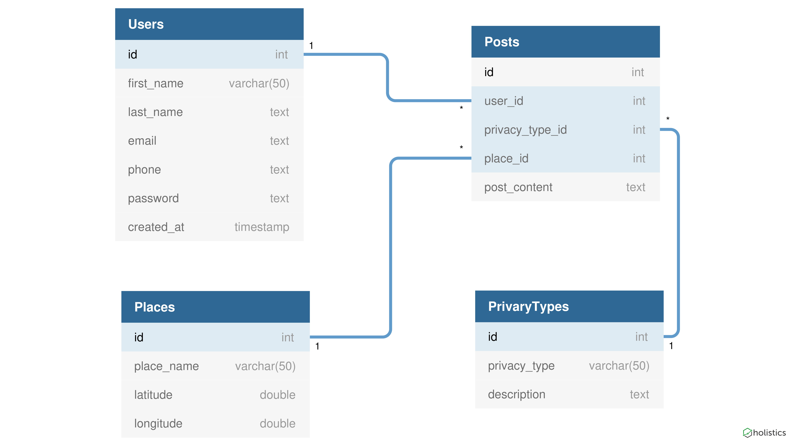

## ER Diagram


##CODE FIRST STYLE
Using Hibernate 
<br>Configure the db.properties file with 
```
db.username = "<username>"
db.password = "<password>"
```

## mysql setup
```
CREATE DATABASE social_traveler
```
<br>
import social_traveler.sql file into your database

